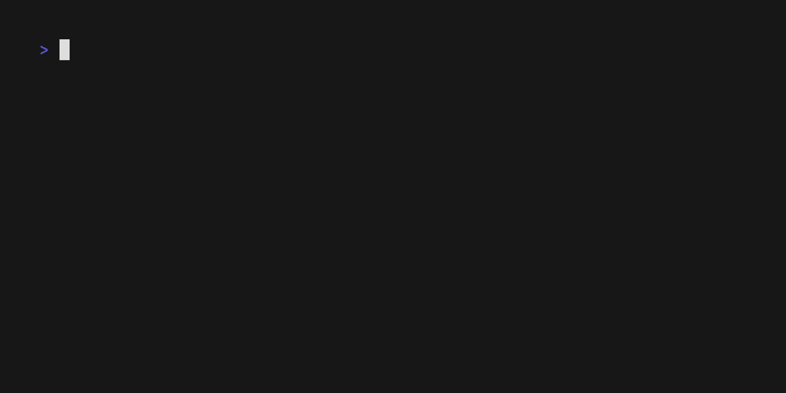

# 🏷️ note-tags

A small and fast command-line utility to search, sort, and open your Markdown notes by `#tags`.

It scans `.md` files in the given directory, extracts hashtags (e.g., `#todo`, `#idea`), and provides an interactive terminal UI for working with them.

## 📺 Demo



## ✨ Features

- 🧩 Extracts `#tags` from Markdown notes (ignores headings like `# Title`)
- 📈 Displays all tags sorted by how frequently they appear
- 📂 Shows all notes related to the selected tag
- 🔍 Previews note contents
- 📝 Opens selected note in your editor
- 🔁 Allows returning to tag list after viewing a note

## 🚀 Installation

```bash
curl -fsSL https://raw.githubusercontent.com/pahMelnik/tagnote/refs/heads/main/install.sh | bash
```

## ✅ Dependencies

Make sure you have the following tools installed:

- [`ripgrep`](https://github.com/BurntSushi/ripgrep)
- [`fzf`](https://github.com/junegunn/fzf)
- [`bat`](https://github.com/sharkdp/bat) *(optional, for better preview)*
- A terminal text editor defined by the `$EDITOR` environment variable  
  (e.g. `nvim`, `vim`, `nano`, or `code -w`)

## 🔧 Usage

```bash
tagnotes /path/to/your/markdown/notes
```

Example:

```bash
tagnotes ~/Documents/notes
```

## 🧠 How It Works

- Scans all .md files recursively
- Uses regular expressions to find tags (#something) that:
    - start with #
    - contain no spaces
    - are not part of a Markdown heading
- Counts how many notes each tag appears in
- Shows tag list sorted by frequency (#tag [5])
- Uses fzf for interactive tag and note selection
- Opens the selected note in your editor

## 👋 Contributing

Pull requests, issues, and suggestions are very welcome!
